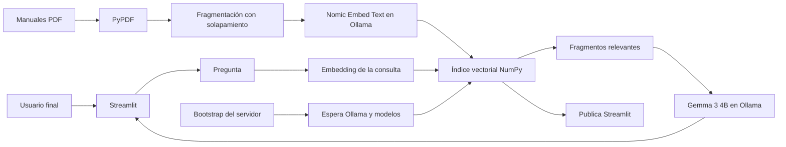

# Asistente RAG — Santos Pegasus Soluciones

Prototipo de un asistente de inteligencia artificial que responde preguntas usando
manuales internos en PDF. Funciona con modelos locales, no requiere API Key ni
servicios de inteligencia artificial pagos y puede ejecutarse localmente o en Oracle
Cloud Infrastructure (OCI).

## Sobre la empresa

**Santos Pegasus Soluciones** es una empresa de tecnología especializada en el
desarrollo de software escalable bajo arquitectura de microservicios y soluciones de
Inteligencia Artificial (RAG). Se destaca por sus rigurosos estándares técnicos en
ingeniería back-end y front-end, garantizando excelencia operativa y seguridad en
infraestructuras de nube (OCI).

## Objetivos del proyecto

- Procesar `Manual_Onboarding.pdf` y `Manual_de_Respuestas_Incidentes.pdf`.
- Extraer y fragmentar automáticamente el contenido de los documentos.
- Crear embeddings y recuperar los fragmentos más relacionados con cada consulta.
- Generar respuestas claras basadas exclusivamente en los manuales.
- Evitar claves de API y llamadas facturables mediante modelos ejecutados con Ollama.
- Entregar una interfaz sobria donde el usuario solamente escribe su pregunta.
- Funcionar primero de forma local y después desplegarse en OCI Compute con Docker.

## Experiencia del usuario

La preparación de la base de conocimiento es una tarea del servidor. El usuario final
no carga archivos, no pulsa botones de indexación y no configura modelos. Cuando la URL
está disponible, solo debe:

1. Abrir la aplicación.
2. Escribir una pregunta en el chat.
3. Leer la respuesta generada a partir de los manuales.

La interfaz no muestra fragmentos recuperados, nombres de archivos, páginas ni
puntuaciones de similitud. Esa información se utiliza únicamente dentro del proceso RAG.

El agente aplica dos controles de alcance: un umbral de similitud semántica descarta
consultas claramente ajenas y una respuesta estructurada de Gemma verifica que el
contexto contenga información suficiente. Ante información ausente, ambigua o fuera del
ámbito documental, responde que no encontró información y no utiliza conocimiento general.

Una capa conversacional local reconoce saludos, agradecimientos y despedidas para ofrecer
un trato más natural y cordial. Estas expresiones no se envían al índice ni al modelo; si
un saludo viene acompañado de una pregunta documental, la consulta continúa normalmente
por el flujo RAG.

## Arquitectura



El índice se guarda en `data/index_*.npz` y sus metadatos en
`data/index_*.json`. Si cambia un PDF, el modelo de embeddings o la configuración de
fragmentación, la aplicación genera automáticamente un índice nuevo.

## Tecnologías utilizadas

- **Python 3.12**: lenguaje principal.
- **Streamlit 1.57+**: interfaz web del asistente.
- **PyPDF**: extracción de texto por página.
- **NumPy**: índice vectorial y similitud coseno.
- **Ollama**: ejecución local de modelos sin credenciales externas.
- **Gemma 3 4B**: modelo generativo para redactar respuestas.
- **Nomic Embed Text**: modelo de embeddings para recuperación semántica.
- **Salida estructurada de Ollama**: validación estricta de respuestas sustentadas.
- **Docker y Docker Compose**: ejecución reproducible y arranque automático.
- **OCI Compute**: infraestructura prevista para el despliegue público.

## Estructura del repositorio

```text
.
├── app.py                         # Interfaz y flujo de conversación
├── src/
│   ├── config.py                  # Variables, modelos y rutas
│   ├── providers.py               # Integración con la API local de Ollama
│   └── rag.py                     # PDF, fragmentación, índice y recuperación
├── scripts/
│   ├── bootstrap.py               # Prepara modelos e índice antes de publicar
│   └── preparar_ollama.ps1        # Preparación inicial de Ollama en Windows
├── data/                          # Manuales e índice local, excluidos de Git
├── tests/test_rag.py              # Pruebas unitarias del núcleo RAG
├── docs/
│   ├── DEPLOY_OCI.md              # Despliegue paso a paso
│   ├── EVIDENCIA_OCI.md           # Plantilla de verificación final
│   └── evidencias/                # Captura real del despliegue
├── .streamlit/config.toml         # Tema visual y configuración del servidor
├── .env.example                   # Configuración sin credenciales
├── Dockerfile
├── docker-compose.yml
├── requirements.txt
└── README.md
```

## 1. Preparación local en Windows

Los siguientes pasos corresponden al administrador o desarrollador. El usuario final
solo accede a la URL.

### 1.1 Instalar herramientas

Instale:

1. [Python 3.12](https://www.python.org/downloads/) con **Add Python to PATH**.
2. [Git](https://git-scm.com/downloads).
3. [Ollama para Windows](https://docs.ollama.com/windows).
4. Opcionalmente, [Docker Desktop](https://docs.docker.com/desktop/setup/install/windows-install/).

### 1.2 Crear el entorno e instalar dependencias

Desde PowerShell, dentro de la carpeta del proyecto:

```powershell
python -m venv .venv
& ".\.venv\Scripts\python.exe" -m pip install --upgrade pip
& ".\.venv\Scripts\python.exe" -m pip install -r requirements.txt
```

No es necesario ejecutar `Activate.ps1`.

### 1.3 Depositar los documentos

Copie los archivos con estos nombres exactos:

```text
data/Manual_Onboarding.pdf
data/Manual_de_Respuestas_Incidentes.pdf
```

Los PDF no se cargan desde la interfaz y están excluidos de Git. PyPDF no realiza OCR;
si un documento contiene únicamente imágenes escaneadas, aplique OCR previamente.

### 1.4 Preparar Ollama

Abra Ollama y ejecute:

```powershell
ollama pull gemma3:4b
ollama pull nomic-embed-text
```

También puede usar el script de preparación administrativa:

```powershell
powershell -ExecutionPolicy Bypass -File .\scripts\preparar_ollama.ps1
```

Copie la configuración base:

```powershell
Copy-Item .env.example .env -Force
```

La aplicación se comunica con Ollama en `http://localhost:11434`. Los documentos y
las preguntas no se envían a un proveedor de modelos externo.

### 1.5 Iniciar la aplicación

```powershell
& ".\.venv\Scripts\python.exe" -m streamlit run app.py
```

Abra [http://localhost:8501](http://localhost:8501). Si todavía no existe un índice,
la aplicación lo crea automáticamente. Las siguientes ejecuciones reutilizan el índice
persistido.

## 2. Ejemplos de uso

- ¿Cuál es el proceso de onboarding durante el primer día?
- Resume las responsabilidades de una persona recién incorporada.
- ¿Qué pasos debo seguir ante un incidente crítico?
- ¿Cuándo debe escalarse la severidad de un incidente?
- ¿Cómo se realiza el cierre de un incidente?
- ¿Cuál es la cotización actual de una moneda? — debe indicar que no está en los manuales.

## 3. Ejecutar pruebas

```powershell
& ".\.venv\Scripts\python.exe" -m unittest discover -s tests -v
```

## 4. Funcionamiento sin servicios de IA pagos

Ollama ejecuta Gemma 3 y Nomic Embed Text en la misma computadora o servidor. No se
utilizan SDK de proveedores pagos, claves de API ni endpoints facturables. El único
costo posible corresponde al equipo o infraestructura donde se ejecute la aplicación.

## 5. Ejecución automatizada con Docker

Con Docker Desktop iniciado:

```powershell
docker compose up -d --build
```

El flujo de arranque realiza automáticamente estas tareas:

1. Inicia Ollama.
2. Espera a que el servicio esté saludable.
3. Descarga los modelos que falten.
4. Procesa los PDF y crea o carga el índice.
5. Publica Streamlit en el puerto 8501.

No es necesario ejecutar scripts manuales para cada usuario. Los contenedores tienen
`restart: unless-stopped`, por lo que vuelven a iniciarse junto con Docker.

Para revisar el estado:

```powershell
docker compose ps
docker compose logs -f
```

## 6. Despliegue en OCI

La guía completa está en [docs/DEPLOY_OCI.md](docs/DEPLOY_OCI.md). Una vez desplegada,
la dirección inicial será:

```text
http://IP_PUBLICA_DE_OCI:8501
```

Antes de un uso productivo se recomienda colocar Nginx, HTTPS y autenticación delante
de Streamlit, además de restringir SSH, configurar alertas de presupuesto y aplicar
mínimo privilegio en OCI.

## Seguridad y límites

- `.env`, los PDF y los índices generados están excluidos del repositorio.
- La interfaz no permite cargar o sustituir documentos.
- El prompt trata el contenido recuperado como datos y rechaza instrucciones incluidas
  dentro de los manuales que intenten modificar el comportamiento del asistente.
- El modelo debe reconocer cuando una respuesta no se encuentra en la base documental.
- Las decisiones críticas deben ser validadas por una persona responsable.
- El prototipo público debe incorporar autenticación antes de usar documentos sensibles.

## Evidencia del despliegue

Después del despliegue real en OCI:

1. Abra la URL pública y confirme que el chat esté disponible.
2. Ejecute al menos tres preguntas de prueba.
3. Registre los resultados en `docs/EVIDENCIA_OCI.md`.
4. Guarde una captura real como `docs/evidencias/app-oci.png`.
5. Incluya la URL pública o IP de OCI en la evidencia.

No se debe incluir una captura ficticia: la evidencia final debe corresponder a la
aplicación ejecutándose realmente en OCI.
