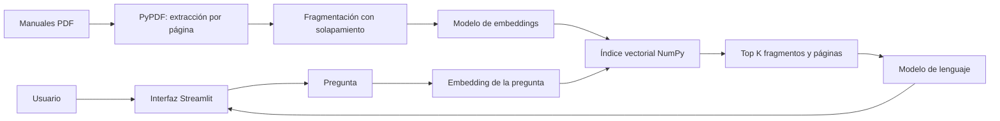

# Asistente RAG — Santos Pegasus Soluciones

Prototipo de un asistente de inteligencia artificial que responde preguntas sobre
manuales internos en PDF, indica el archivo y la página utilizados y puede ejecutarse
localmente o en una instancia de Oracle Cloud Infrastructure (OCI).

## Sobre la empresa

**Santos Pegasus Soluciones** es una empresa de tecnología especializada en el
desarrollo de software escalable bajo arquitectura de microservicios y soluciones de
Inteligencia Artificial (RAG). Se destaca por sus rigurosos estándares técnicos en
ingeniería back-end y front-end, garantizando excelencia operativa y seguridad en
infraestructuras de nube (OCI).

## Objetivos

- Procesar `Manual_Onboarding.pdf` y `Manual_de_Respuestas_Incidentes.pdf`.
- Recuperar los fragmentos más relacionados con cada pregunta.
- Generar respuestas claras basadas solamente en los manuales.
- Mostrar trazabilidad mediante archivo, página, fragmento y puntuación de similitud.
- Ofrecer una interfaz sobria y sencilla para usuarios no técnicos.
- Ejecutarse primero en local y luego desplegarse en OCI Compute mediante Docker.

## Arquitectura



El prototipo evita una base vectorial externa para reducir la complejidad inicial.
Guarda el índice en `data/index_*.npz` y sus metadatos en `data/index_*.json`. Si un
PDF o la configuración de embeddings cambia, crea automáticamente otro índice.

## Tecnologías

- Python 3.11 o 3.12
- Streamlit para la interfaz gráfica
- PyPDF para extraer texto por página
- NumPy para búsqueda vectorial por similitud coseno
- OpenAI Responses API y embeddings, o alternativamente Ollama
- Docker y Docker Compose
- OCI Compute para el despliegue

## Estructura

```text
.
├── app.py                      # Interfaz Streamlit
├── src/
│   ├── config.py               # Configuración y rutas
│   ├── providers.py            # Proveedores OpenAI/Ollama
│   └── rag.py                  # Extracción, indexación, búsqueda y respuesta
├── data/                       # Deposite aquí los PDF (no se suben a Git)
├── tests/test_rag.py           # Pruebas unitarias
├── docs/DEPLOY_OCI.md          # Despliegue explicado paso a paso
├── .streamlit/config.toml      # Tema visual y servidor
├── .env.example                # Variables necesarias, sin secretos
├── Dockerfile
├── docker-compose.yml
└── requirements.txt
```

## 1. Preparación local en Windows

### 1.1 Instalar herramientas

Instale:

1. [Python 3.12](https://www.python.org/downloads/) y marque **Add Python to PATH**.
2. [Git](https://git-scm.com/downloads).
3. Opcional: [Docker Desktop](https://docs.docker.com/desktop/setup/install/windows-install/).

Abra PowerShell dentro de la carpeta del proyecto y compruebe:

```powershell
python --version
git --version
```

### 1.2 Crear el entorno virtual

```powershell
python -m venv .venv
.\.venv\Scripts\Activate.ps1
python -m pip install --upgrade pip
python -m pip install -r requirements.txt
```

Si PowerShell bloquea la activación, ejecute una vez en esa ventana:

```powershell
Set-ExecutionPolicy -Scope Process -ExecutionPolicy Bypass
.\.venv\Scripts\Activate.ps1
```

### 1.3 Depositar los documentos

Copie los archivos en la carpeta **`data/`** del proyecto. Las rutas finales deben
ser exactamente:

```text
data/Manual_Onboarding.pdf
data/Manual_de_Respuestas_Incidentes.pdf
```

También puede cargarlos desde el panel lateral de la aplicación. Los PDF y el índice
están en `.gitignore` para evitar publicar información interna por accidente.

> PyPDF extrae texto, pero no hace OCR. Si un PDF contiene solamente imágenes
> escaneadas, aplique OCR antes de utilizarlo.

### 1.4 Configurar OpenAI

1. Cree una clave en [OpenAI API keys](https://platform.openai.com/api-keys).
2. Copie el ejemplo de configuración:

```powershell
Copy-Item .env.example .env
notepad .env
```

3. Complete solamente esta línea, sin comillas:

```dotenv
OPENAI_API_KEY=su_clave_aqui
```

El modelo de respuesta predeterminado es `gpt-5.6-luna`, elegido para un prototipo
de volumen moderado. Se usa la Responses API, recomendada actualmente por OpenAI
para aplicaciones nuevas. Puede cambiar el modelo desde `.env`. Consulte la
[guía oficial de modelos](https://developers.openai.com/api/docs/guides/latest-model)
y la [guía oficial de embeddings](https://developers.openai.com/api/docs/guides/embeddings).

La API de ChatGPT/OpenAI se factura por uso y no forma parte automáticamente de una
suscripción de ChatGPT. Nunca suba `.env` a Git.

### 1.5 Ejecutar

```powershell
python -m streamlit run app.py
```

Abra [http://localhost:8501](http://localhost:8501), confirme que aparecen los dos
manuales y pulse **Procesar documentos**. La primera indexación llama al modelo de
embeddings; las siguientes ejecuciones reutilizan el índice guardado.

### 1.6 Probar

Ejemplos de preguntas:

- ¿Cuál es el proceso de onboarding durante el primer día?
- Resume las responsabilidades de una persona recién incorporada.
- ¿Qué pasos debo seguir ante un incidente crítico?
- ¿Cómo y cuándo se escala un incidente?
- ¿En qué manual y página se explica el cierre de un incidente?

Una respuesta válida debe citar `[F1]`, `[F2]`, etc. y el desplegable **Fuentes
consultadas** debe mostrar el manual y la página. Pruebe además una pregunta ajena a
los documentos: el asistente debe reconocer que no encontró la información.

### 1.7 Ejecutar pruebas

```powershell
python -m unittest discover -s tests -v
```

## 2. Alternativa sin API: Ollama

Instale [Ollama](https://ollama.com/download), descargue los modelos y modifique
`.env`:

```powershell
ollama pull gemma3:4b
ollama pull nomic-embed-text
```

```dotenv
RAG_PROVIDER=ollama
OLLAMA_BASE_URL=http://localhost:11434
OLLAMA_CHAT_MODEL=gemma3:4b
OLLAMA_EMBEDDING_MODEL=nomic-embed-text
```

Ollama no envía el contenido a OpenAI, pero requiere más memoria y CPU. Para el
primer despliegue económico en OCI se recomienda comenzar con el proveedor OpenAI.

## 3. Ejecutar con Docker

Con Docker Desktop iniciado:

```powershell
docker compose up --build
```

La carpeta `data/` se monta como volumen, por lo que los documentos y el índice
persisten al reconstruir el contenedor. Para detenerlo:

```powershell
docker compose down
```

## 4. Despliegue en OCI

Siga [docs/DEPLOY_OCI.md](docs/DEPLOY_OCI.md). El resultado inicial será accesible en:

```text
http://IP_PUBLICA_DE_OCI:8501
```

Para producción, coloque HTTPS y autenticación delante de Streamlit. Este prototipo
no incluye inicio de sesión; no publique manuales confidenciales hasta implementar
un control de acceso.

## Seguridad y límites del prototipo

- Las claves se leen desde variables de entorno y no se guardan en el código.
- Los PDF, `.env` e índices están excluidos de Git.
- En OCI, configure `ALLOW_PDF_UPLOAD=false` para impedir que visitantes sustituyan
  los manuales.
- El prompt trata el contenido recuperado como datos no confiables y solicita ignorar
  instrucciones maliciosas dentro de los PDF.
- Las citas ayudan a auditar respuestas, pero una persona debe validar decisiones
  críticas.
- Para producción se recomienda autenticación, HTTPS, OCI Vault, observabilidad,
  copias de seguridad y evaluaciones RAG con preguntas/respuestas esperadas.

## Evidencia del despliegue

Cuando OCI esté operativo, complete `docs/EVIDENCIA_OCI.md`, agregue una captura en
`docs/evidencias/app-oci.png` y registre al menos tres preguntas de prueba. No se
incluye una captura ficticia: la evidencia debe mostrar la URL o IP pública real.

