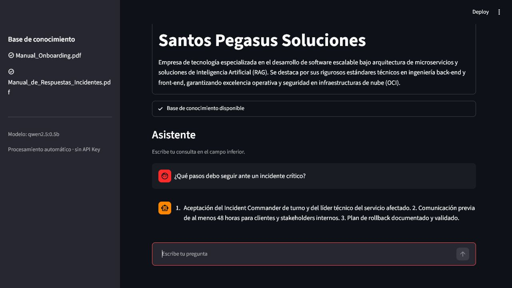
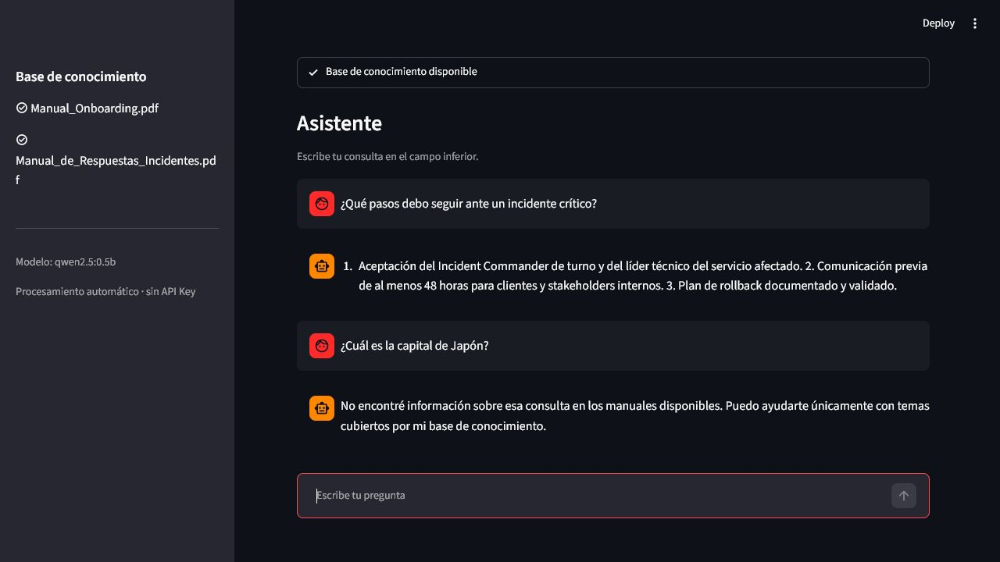

# Evidencia de funcionamiento en OCI

Registro de las pruebas reales del prototipo de Santos Pegasus Soluciones. No se
incluyen credenciales, claves privadas ni fragmentos confidenciales extensos.

## Datos del despliegue

- Fecha: 21 de julio de 2026
- Región OCI: São Paulo
- Sistema operativo: Ubuntu 24.04.4 LTS
- Tipo de instancia: `VM.Standard.E2.1.Micro`
- Recursos: 1 GB de RAM, 2 vCPU lógicas y 8 GB de swap persistente
- Contenedores: Docker 29.1.3 y Docker Compose 2.40.3
- Modelo: `qwen2.5:0.5b`
- Embeddings: `nomic-embed-text`
- IP pública: `163.176.222.158`
- URL pública: [http://163.176.222.158:8501/](http://163.176.222.158:8501/)
- Health check: `http://163.176.222.158:8501/_stcore/health`
- Estado del health check: `200 OK` — respuesta `ok`

## Pruebas de uso

| Nº | Pregunta | Resultado esperado | Resultado obtenido |
|---:|---|---|---|
| 1 | ¿Qué pasos debo seguir ante un incidente crítico? | Respuesta basada en el manual de incidentes | Correcto: indicó aceptación del Incident Commander y líder técnico, comunicación previa y plan de rollback. |
| 2 | ¿Cuál es la capital de Japón? | Debe indicar que no está en los manuales | Correcto: indicó que no encontró información y que sólo responde con su base de conocimiento. |

## Captura

### Pregunta dentro del ámbito

### Pregunta fuera del ámbito

## Observaciones

- La aplicación carga automáticamente el índice y habilita el chat sin solicitar
  archivos, claves de API ni pulsar un botón de procesamiento.
- La instancia gratuita tiene memoria limitada; se añadió un archivo swap persistente
  de 8 GB y se eligió Qwen 2.5 0.5B para mantener el servicio operativo.
- La respuesta documental puede tardar varios minutos. Las consultas claramente fuera
  de alcance se descartan con rapidez mediante similitud semántica.
- Ambos contenedores se verificaron en estado saludable.
- FortiGuard bloquea la IP sin dominio desde la red corporativa. Las capturas se
  realizaron por un túnel SSH temporal a la misma instancia, y el puerto público se
  verificó de forma externa.
- Como mejora, se recomienda configurar dominio, Nginx y HTTPS antes de un uso
  productivo.
